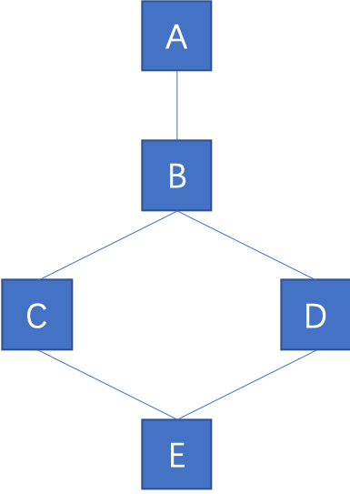

# 语言特性

在谈论程序语言的时候，我们经常会说到“语言特性”，可是具体什么是语言特性，又有哪些语言特性呢？

## 代码块的组织形式

1. 花括号，如 C/C++，Java，Swift 等。
2. 缩进，如 Python，Haskell 等。
3. 关键字列表：如 [Elixir](https://elixir-lang.org)。

```elixir
if false, do: :this, else: :that
```

注意这里的两个逗号，这是 Elixir 被称作关键字列表的语法。

## 具名参数

在函数定义时直接给形参分配变量名，如 Objective C，Swift 等。

```swift
func greet(person: String, from hometown: String) -> String {
    return "Hello \(person)!  Glad you could visit from \(hometown)."
}
```

与之相对的是传统的位置参数，即函数参数是通过传入次序标识的，如 C。很多语言支持混合的形式，如 Python。

```python
def f(pos_only, /, pos_or_kwd, *, kwd_only):
    pass
```

这是 Python 3.8 引入的形式，`/` 前面是只能通过位置来标识的参数；`*` 后面是必须给出名字的参数，形如 `kwd_onl=value`；两者之间则是否给定参数名都可以。

## 参数打包/参数解包

```python
def fun(a, b, c, d):
    print(a, b, c, d)
my_list = [1, 2, 3, 4]
fun(my_list)
```

执行以上 Python 代码会报错：`TypeError: fun() missing 3 required positional arguments: 'b', 'c', and 'd'`。

需要使用 `*` 对参数列表进行解包。

```python
def fun(a, b, c, d):
    print(a, b, c, d)
my_list = [1, 2, 3, 4]
fun(*my_list)
```

反之我们还可以打包，在参数个数不确定的情况下传入一个参数包。

`*` 打包元组。

```python
def myFun(arg1, *argv):
    print ("First argument :", arg1)
    for arg in argv:
        print("Next argument through *argv :", arg)
myFun('Hello', 'Welcome', 'to', 'GeeksforGeeks')
```

`**` 打包字典。

```python
def myFun(**kwargs):
    for key, value in kwargs.items():
        print ("%s = %s" % (key, value))
myFun(first = 'Geeks', mid = 'for', last= 'Geeks')
```

## 显式类型

C，Swift，Java 等静态语言的参数、返回等都包含类型信息，这使得推理函数调用更加简单，但是也影响了灵活性和开发效率。

反之 Python 等动态语言没有显式类型信息，也没有编译期的类型检查。在 PEP 484 后 Python 支持部分添加类型的混合形式，被称作渐进定型（gradual typing）。

## 一等函数

类型，定义了一个取值的集合，以及可作用的操作的集合。如 C 的 int 类型有一个上下界，可进行加减乘除等操作。

类型可以分为三类：

1. 一等（First-class）。该类型的值可以作为函数的参数和返回值，也可以赋给变量。
2. 二等（Second-class）。该类型的值可以作为函数的参数，但不能从函数返回，也不能赋给变量。
3. 三等（Third-class）。该类型的值作为函数参数也不行。

多数程序语言中的整型、字符型都是一等的。在函数式语言（或支持函数式的语言）中，函数也是一等的，或者说函数是“一等公民”（如 Javascript，Swift，Haskell，Elixir 等）。以函数为参数或返回值的函数称为“高阶函数”。map, reduce, filter 等就是经典的高阶函数。

## 装饰器

装饰器允许我们用一个函数包裹另一个函数，以扩展被包裹函数的行为，而不需要永久地修改它。装饰器基于一等函数。

以下是在 Python 中的典型用法。

```python
import time
import math

def calculate_time(func):
    def inner1(*args, **kwargs):
        begin = time.time()
        func(*args, **kwargs)
        end = time.time()
        print("Total time taken in {} : {}".format(func.__name__, end - begin))
    return inner1

@calculate_time
def factorial(num):
    time.sleep(2)
    print(math.factorial(num))

factorial(10)
```

## 列表解析（List comprehension）

Python，Haskell，Elixir 等支持用递推式构造列表：

```python
lst1 = [1, 2, 3]
lst2 = [(i+1) for i in lst1]
```

## 求值策略：立即求值/惰性求值

编程语言使用求值策略来确定两件事：何时对函数调用的参数求值以及传递给函数何种类型的值。

如以下测试所示，一般情况下 Python 使用立即求值，即在将表达式绑定到变量后立即对其求值。这一策略使得程序的调试更加清晰，开发者不必担心出现违反直觉的执行顺序。

```python
def f(a, b):
    print(a + 3)
def s(n):
    print(n)
    return n
f(s(1), s(2))
```

输出：

```
1
2
4
```

与之相反的惰性求值也有好处，比如可以减少计算量、支持无限集等（如 Haskell）。

另一种常见的策略是根据数据类型选择求值策略，如 Elixir 对 `Enum` 采用立即求值，对 `Stream` 则采用惰性求值。

回到列表解析的例子，当 `lst1` 过大时会产生内存错误，这也反面印证 Python 使用了立即求值。

然而，生成器是可以提供惰性求值效果的一个例外。

```python
lst1 = [1, 2, 3]
lst2 = ((i+1) for i in lst1)
next(lst2)
```

使用 `[]` 返回列表，`()` 则返回生成器，`lst2` 的各项只有在被 `next` 调用到的时候才会被求值。

## 继承

Python 支持 5 种类的继承：

1. 单继承（Single Inheritance），意味着一个类是从另一个类派生的。
2. 多重继承（Multiple Inheritance），意味着一个类派生自多个类。
3. 多级继承（Multilevel Inheritance），意味着存在一个儿子级和孙子级的关系，即类 A 从类 B 派生，类 B 又从类 C 派生。
4. 层次继承（Hierarchical Inheritance），意味着有多个类是从同一类派生的。
5. 混合继承（Hybrid Inheritance），即多种继承的组合。

下图是一个包含所有 1-4 类继承（依次为：AB，CDE，ABC，BCD）的混合继承，并且包含一种特殊的菱形继承（Diamond Inheritance）（BCDE）。



## 类型类（Typeclass）

类型类类似于 Java 中的接口，或者 Objective-C 中的协议。在类型类中定义了一些函数，实现一个类型类就是实现这些函数，而所有实现了这个类型类的数据类型都会拥有这些共同的行为（Functor、Applicative、Monad）。[typeclasses](https://github.com/thejohnfreeman/python-typeclasses) 这个 Python 库模仿了 Haskell 的类型类。

## 多态

多态是一个与类型类相关的概念。

### 特设多态（Ad hoc polymorphism）

多态函数有多个不同的实现，依赖于其实参而调用相应版本的函数。因此，特设多态仅支持有限数量的不同类型。函数重载乃至运算符重载就是特设多态的一种。

Ad hoc 是指这类多态并不是类型系统的基本特性，不是像参数多态那样适用于无穷多的类型，而是针对特定问题的解决方案。

例如 C++ 的模版。仅有当一个模板被填上类型（或非类型）参数时才会接受编译器的检查及编译，而不是预先进行检查（指对模板内容检查）以确定何种参数可以交给这个模板。

### 参数多态（Parametic polymorphism）

指声明与定义函数、复合类型、变量时不指定其具体的类型，而把这部分类型作为参数使用，使得该定义对各种具体类型都适用。这被称为泛型函数、泛型数据类型、泛型变量，形成了泛型编程的基础。

最早见于 ML 语言。

### 子定型（Subtyping，Inclusion polymorphism）

子类型可以替换另一种相关的数据类型（超类型，supertype）。也就是说，针对超类型元素进行操作的子例程、函数等程序元素，也可以操作相应的子类型。（协变、逆变）

## 重载

重载一般是静态语言中的概念，允许方法有多个签名，接收不同类型或数量的参数。

## 封装（Encapsulation）

封装是指将数据和对数据进行操作的方法捆绑在一起，或限制对某些对象组件的直接访问。

如 C++ 和 Java 中的 protected 成员，可以在类和子类的内部访问，而不能从外部访问；private 成员则对子类也不可见。Python 用前置单下划线（`_成员名`）表示 protected，前置双下划线（`__成员名`）表示 private，但是前者只是一种使用习惯而不产生任何实际效果，后者实则只是重命名为“`_类名__成员名`”。

## 函数嵌套

在函数内部定义函数，可以提高函数复用和模块化，同时使得外部不可见。

## 类嵌套

在另一个类或接口的主体内声明的类。

## 闭包（Closure）

基于函数嵌套。

```python
def outerFunction(text):
    text = text
    def innerFunction():
        print(text)
    return innerFunction
myFunction = outerFunction('Hey!')
myFunction()
```

## 内省（Introspection）

内省是程序在运行时检查对象的类型或属性的能力。

例如 Python 提供了一些具有内省特性的内置函数，包括 `type()`，`dir()`，`id()`，`hasattr()`，`isinstance()`，`callable()`，`issubclass()`，`__doc__`等。

## 反射（Reflection）

内省是一种运行时的对象检测机制（type or properties of an object）；反射则更进一步，使得程序具有在运行时动态修改自己的结构和行为的能力（values, meta-data, properties and/or functions of an object）。

## 异构列表

指包含不同元素类型的列表。

## 模式匹配

C、Swift（switch），Haskell，OCaml 等支持模式匹配；Python 本身不支持，但是可以通过第三方库扩展（[Pampy](https://github.com/santinic/pampy)）。

## 多值返回

在函数返回时可以以逗号分隔而不带括号的形式返回一个元组（如 Python），而无需另外构建一个存储了所有值的对象（如 C，Java）。

## 递归/循环

有些语言不支持循环，而必须使用递归（如 Haskell），多数语言同时支持两者。

## 异常

不支持异常的语言包括 C 等。